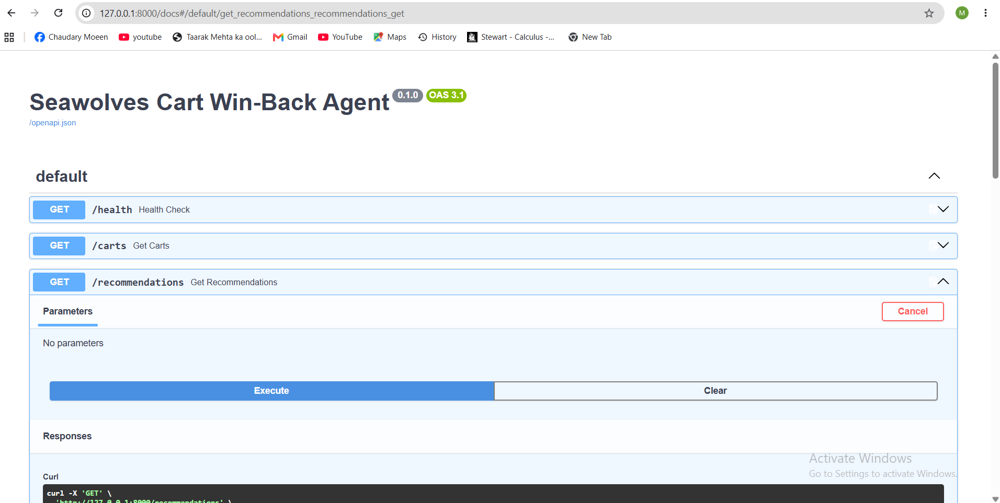
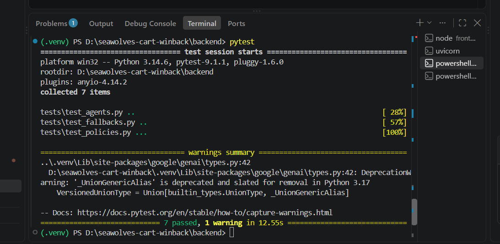
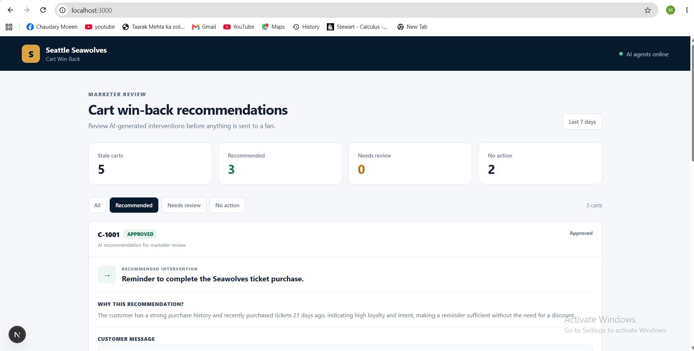
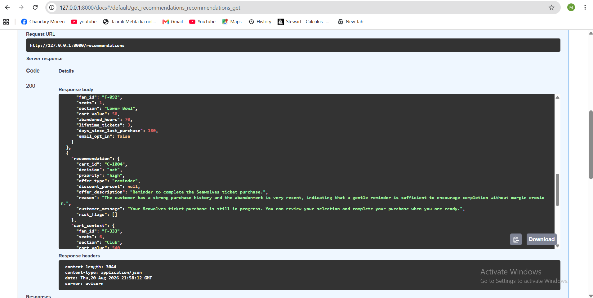
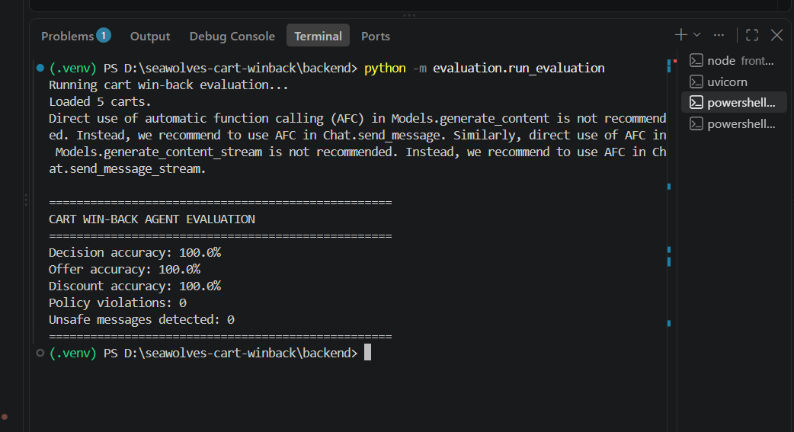

## Screenshots

### Marketer Dashboard

The Next.js marketer interface provides a review workflow for AI-generated cart
win-back recommendations, including recommendation status, cart counts, and
human review controls.

### Evaluation Results

The automated evaluation currently reports 100% decision, offer, and discount
accuracy, with zero policy violations and zero unsafe-message flags.

### Automated Tests

The backend test suite currently passes all 7 collected tests.

### API Documentation

The FastAPI application exposes interactive OpenAPI/Swagger documentation for
the health, cart, and recommendation endpoints.

### API Response

The recommendation endpoint returns structured recommendation data including
decision, priority, offer type, discount, reasoning, customer message, and risk
flags.

